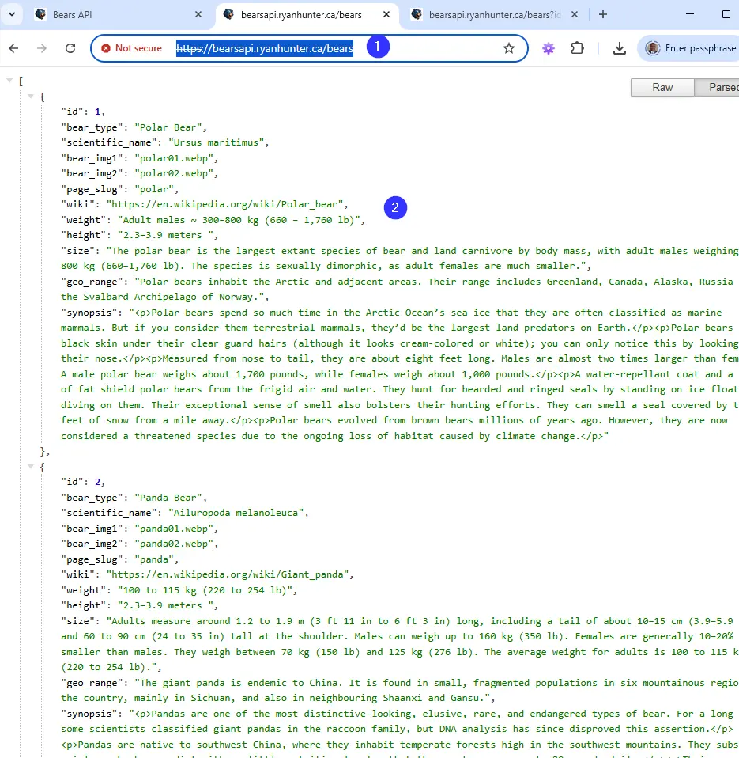
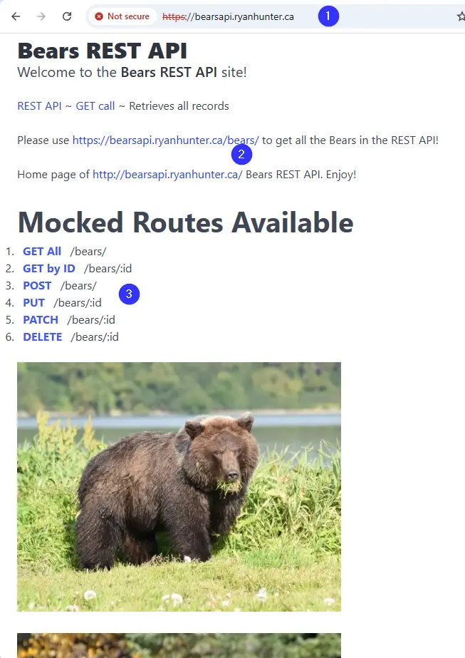
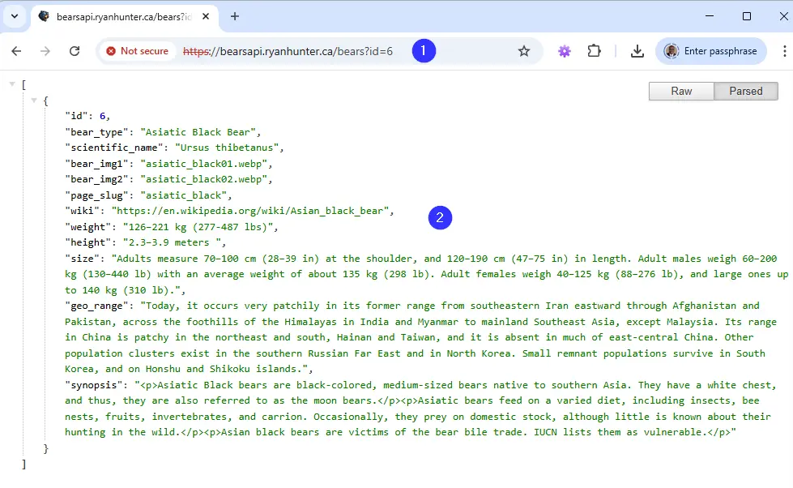

# Bears List API 
A simple JSON-base REST API based on JSON Placeholder. To be consumed by a Django project, soon to be deployed.

Live **Site Demo** ~ [Site ~ Bears REST API](http://bearsapi.ryanhunter.ca/bears/) 

Live **GET All** ~ [https://bearsapi.ryanhunter.ca/bears](https://bearsapi.ryanhunter.ca/bears) 

Live **GET by ID 6** ~ [https://bearsapi.ryanhunter.ca/bears?id=6](https://bearsapi.ryanhunter.ca/bears?id=6) 

## Steps to Install 
- Run the command below from the command line / terminal / command prompt.
- git clone https://github.com/systemsvanguard/bearsapi.git  
- cd bearsapi
- ensure your have Node & NPM pre-installed. 
- Run commands 'node --version && npm -v'.
- npm install.  (This ensures all dependencies are installed).
- npm start
- Runs on port 4001 via .env variable --> http://localhost:4001/ 
- Change the web port as needed.
- For the currently live deployed site, the GET All endpoint is at https://bearsapi.ryanhunter.ca/bears 
- Site home is https://bearsapi.ryanhunter.ca    

## Features
- Node.js
- JSON Placeholder
- RESTful API
- JSON 
- Bulma CSS framework 

## License
This project is licensed under the terms of the **MIT** license.

## Screenshots 

 

 

  
